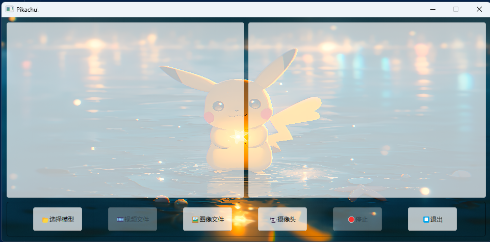

## 运行方式
1. **文件路径**
   
   请将yolo文件夹中文件放置到ultralytics目录下

3. **运行**
   
   先修改gui.py中self.background_image对应的路径，可以换成自己喜欢的图片，然后
   ```bash
   python gui.py
   ```
   
   
   选择模型权重best.pt,选择测试图片test.jpg,也可以打开你的摄像头咳
5. **训练**
   
     请参照data.yaml格式配置数据集，注意，数据集要符合yolo官方标准，可以在ultralytics的readme中获取
     更换train.py中的路径，相信大家会看得懂的
